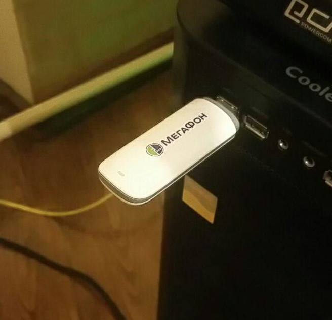

Asterisk-dongle-setup
=====================

In this playground project we try to setup Asterisk server to work with
[GSM-modem dongle](https://github.com/wdoekes/asterisk-chan-dongle) using
[Nix](https://nixos.org) package manager.

The project aims at automating the configuration of software able to solve the
following tasks:

* [x] Receive SMS messages and forward them to a Telegram chat.
* [x] Receieve Incoming voice calls to Telegram.
* [ ] Send outgoing voice calls from Telegram.
* [x] Handle incoming voice calls with a Lenny chat bot.
* [ ] Voice room with a chat bot.

Contents
--------

1. [Setup](#Setup)
   - [Walkthrough](#Walkthrough)
   - [Doing USB Modeswitch manually](#Doing-USB-Modeswitch-manually)
   - [Nix-shell](#Nix-shell)
2. [Hardware notes](#Hardware-notes)
3. [Thirdparty issues](#Thirdparty-issues)
4. [Administration hints](#Administration-hints)
4. [References](#References)

Setup
-----

### Walkthrough

0. Install [Nix package manager](https://nixos.org/guides/install-nix.html).
   Note that it could easily co-exist with your native package manager. We use
   [20.03 Nixpkgs tree](https://github.com/NixOS/nixpkgs/tree/076c67fdea6d0529a568c7d0e0a72e6bc161ecf5/)
   as a base.
1. Go and get a GSM modem.

   

   You need to find a
   supported GSM modem and plug it into the USB port of your computer. We tested
   `Huawei-E173` only, but in theory any model supported by
   [chan_dongle](https://github.com/wdoekes/asterisk-chan-dongle)
   should work.
   - A somewhat outdated document about supported hardware is available
     [here](https://github.com/bg111/asterisk-chan-dongle/wiki/Requirements-and-Limitations).
     We typically do care about Voice and SMS functions and don't care about USSD.
   - `./asterisk.sh` will check for the presence of `/dev/ttyUSB0`. If
     it is not present, the script would attempt to run the `usb_modeswitch`
     procedure.
   - **Currently we automate switching only for Huawei E173 modem**.
     For other models, try to follow the section about [manual mode-switching](#Doing-USB-Modeswitch-manually).
2. `git clone --recursive <this-repo-url> ; cd ...`
3. Create `./secrets.nix` file by copying and editing `./secrets_template.nix`.
   - You need a mobile phone which is bound to some Telegram account.
   - Go to https://my.telegram.org/auth and register an API Client instance.
     You will be provided with `api_id` and `api_hash` values.
   - The bot token field is not currently used.
   - The Chat id field is a (typically negative) identifier of a chat to send SMS messages
     to. `./asterisk.sh` will print available chat identifiers at
     some point during the startup.
4. **Please be informed that the main script `./asterisk.sh` is VERY INSECURE.
   It configures Asterisk to use binary codec and then runs it as root.**
5. If you are OK with the above notice, run `./asterisk.sh`.
   - At first run script will initialize Telegram session for python relay
     script.
     + As a part of initialization, Telegram server will send a digital
       code to your Telegram account.
     + You are to type this code back into the script.
   - At first run the script will also initialize another Telegram session, this
     time for `tg2sip` (TODO: find out how to reuse the first session).
     + It will ask you a phone number with Telegram account.
     + Telegram will send a code to your account. You have to read it and type
       it back into the script.
6. ???
7. Do something:
   * To send SMS from the GSM modem, use the Asterisk CLI: `dongle sms dongle0
     89097777777 HiHi`.
   * Send SMS or make a call to your GSMmodem's SIM card. Asterisk will redirect
     them to your Telegram account.
   * Also Asterisk will record calls and send recordings to Telegram.

### Doing USB Modeswitch manually

`asterisk.sh` attempts to run usb_modeswitch procedure automatically for devices
known to author. In case the procedure fails, one could attempt the manual way:

1. `nix-build -A usb_modeswitch`.
2. `lsusb` to find out your modem's vendor:product numbers
3. `sudo ./result/usr/sbin/usb_modeswitch -v <vendor> -p <product> -X`
4. `/dec/ttyUSB[01]` devices should appear. You should be able
   to `minicom -D /dev/ttyUSB0` and type some AT command, say `ATI`.
5. Update `asterisk.sh` script by adding new line like below to the
   corresponding place
   ```
   try_to_deal_with "<your_device_id>" "<your_device_vendor>" && wait_for_chardev "/dev/ttyUSB0"
   ```
6. Send us a PR with it.

### Nix-shell

Author uses VIM as the main development IDE. The start procedure is as follows:

```
$ nix-shell
(nix-shell) $ vim .   # Edit sources enjoying code navigaiton
(nix-shell) $ ipython # Testing telethon bot, etc
```

Hardware notes
--------------

We use the following USB dongle:

```
*CLI> dongle show devices
ID           Group State      RSSI Mode Submode Provider Name  Model      Firmware          IMEI             IMSI             Number
dongle0      0     Free       9    0    0       Beeline        E173       11.126.85.00.209  ***************  ***************  Unknown
```

See also [somewhat outdated list of supported devices](https://github.com/bg111/asterisk-chan-dongle/wiki/Requirements-and-Limitations)

Thirdparty issues
-----------------

* ~~https://github.com/wdoekes/asterisk-chan-dongle/issues/109~~
* ~~https://github.com/wdoekes/asterisk-chan-dongle/issues/110~~
* ~~https://github.com/wdoekes/asterisk-chan-dongle/issues/121~~
* ~~https://github.com/Infactum/tg2sip/issues/42~~
* ~~https://community.asterisk.org/t/help-translating-a-simple-peer-config-to-pjsip/86601~~
* https://github.com/wdoekes/asterisk-chan-dongle/issues/120
* Binary codec `chan_opus.so` is required by tg2sip. Consider replacing it with
  https://github.com/traud/asterisk-opus
* On top of above, we run Asterisk is as root, due to `chan_dongle` hardcodings.
* `dongleman_daemon` has to reconnect automatically in case of network failures.
  Currently it issues the error `ConnectionError: Cannot send requests while
  disconnected`.

Administration hints
--------------------

### Ulaw audio operations:

* Converting 3gpp to ulaw: `./3gpp2ulaw.sh`
* Playing ulaw file: `aplay -t raw -f MU_LAW <FILE>`

### Cutting last x seconds from an audio file

```sh
cutlast() {
  ffmpeg -i "$2" -ss 0 -to $(echo $(ffprobe -i "$2" -show_entries format=duration -v quiet -of csv="p=0") - "$1" | bc) -c copy "$3"
}
```

### Clearing dongle SMS messages

```sh
#!/bin/bash -x
cmds()
{
cat <<EOF
dongle cmd dongle0 AT+CPMS=\"SM\",\"SM\",\"SM\"
dongle cmd dongle0 AT+CMGD=1,4
dongle cmd dongle0 AT+CPMS=\"ME\",\"ME\",\"ME\"
dongle cmd dongle0 AT+CMGD=1,4
exit
EOF
}

cmds | asterisk -r
```

References
----------

### GSM modems

* Asterisk+Dongle setup guide (in Russian)
  http://linux.mixed-spb.ru/asterisk/dongle_app1.php
* Another Dongle guide in Russian
  https://jakondo.ru/podklyuchenie-gsm-modema-usb-huawei-e1550-k-asterisk-13-chan_dongle-na-debian-8-jessie/
* Random GSM software:
  - GSMCTL (abandoned?) https://www.unix.com/man-page/debian/8/gsmctl/
  - MMCLI https://www.freedesktop.org/software/ModemManager/man/1.0.0/mmcli.8.html

### Asterisk

* Asterisk Wiki https://wiki.asterisk.org/wiki/display/AST
* Generic information about PJSIP https://wiki.asterisk.org/wiki/display/AST/PJSIP+Configuration+Sections+and+Relationships
* An article about PJSIP configuration https://www.redhat.com/sysadmin/asterisk-dialplan
* Setting up TG2SIP (In Russian) https://voxlink.ru/kb/asterisk-configuration/ustanovka-i-nastrojka-sip-shljuza-dlja-telegram/
* About OPUS codec:
  - https://community.asterisk.org/t/codec-opus-source-code/72738/6
  - Binary opus module 'sends some statistics back to Digium' http://downloads.digium.com/pub/telephony/codec_opus/
  - OpenSource equivalent https://github.com/traud/asterisk-opus
* Important dialplan commands:
  - Dial https://wiki.asterisk.org/wiki/display/AST/Application_Dial
* ULAW file format
  - https://ixnfo.com/en/how-to-convert-audio-files-to-ulaw-alaw-gsm-g722-etc-for-asterisk.html


**ARI**

* ARI (probably the preferred way to interact with Asterisk)
  - ARI Python interface https://github.com/asterisk/ari-py
  - Introduction to ARI and channels
    https://wiki.asterisk.org/wiki/display/AST/Introduction+to+ARI+and+Channels
* ARI (without Python)
  https://wiki.asterisk.org/wiki/display/AST/Getting+Started+with+ARI
* Local ARI explorer http://ari.asterisk.org/#!/asterisk
* About `wscat` in NixOS
  https://msitko.pl/blog/2020/04/22/isolated-ennvironments-with-nix-shell-and-zsh.html
* A sample websocket app in Python
  https://linuxhint.com/how-to-implement-a-websocket-in-python/
* Python Websocket docs https://websockets.readthedocs.io/en/3.0/intro.html
* Habr post about ARI https://habr.com/ru/post/308652/

### Telegram

* Client API access page https://my.telegram.org/auth
* Telethon API client documentation https://docs.telethon.dev/en/latest/
* TG2SIP https://github.com/Infactum/tg2sip
* Setting up TG2SIP (In Russian) https://voxlink.ru/kb/asterisk-configuration/ustanovka-i-nastrojka-sip-shljuza-dlja-telegram/
* AsyncIO inotify interface https://github.com/giannitedesco/minotaur
* AsyncIO inotify https://asyncinotify.readthedocs.io/en/latest/
* AsyncIO wait for multiple events
  http://www.hydrogen18.com/blog/python-await-multiple.html

### Fun

* Lenny https://crosstalksolutions.com/howto-pwn-telemarketers-with-lenny/

